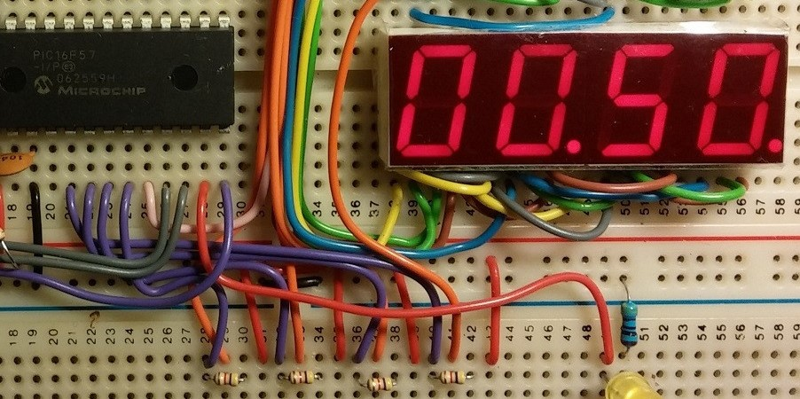
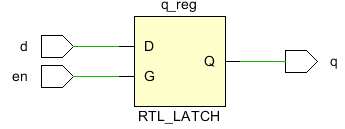

.. highlight:: verilog

Fundamentos del lenguaje Verilog
================================

En esta sección se cubren los principales fundamentos del lenguaje de descripción de hardware Verilog.

Módulos
-------

Un módulo en Verilog es un bloque de código que ejecuta cierta funcionalidad. Un módulo puede contener una instancia de otro módulo, y el módulo de nivel superior puede comunicarse con los módulos de nivel inferior a través de sus puertos de entrada y salida.

Los módulos se definen entre las *keywords* ``module`` y ``endmodule``. El nombre del módulo se coloca inmediatemente después de ``module`` y además se pueden definir sus puertos, de la siguiente manera::

    module <nombre> (a, b, c, d);
        input a, b;
        output c, d;
        // Contenido del modulo
    endmodule

Cada puerto (a, b, c, d) debe ser definido como una entrada o salida, según corresponda.

Tipos de Dato
-------------

Los tipos de dato en Verilog buscan representar elementos de almacenamiento, como los bits en un flip-flop, o elementos de transmisión de datos, cómo buses o cables que interconectan puertas logicas.

Valores Almacenados
^^^^^^^^^^^^^^^^^^^

Existen 4 distintos valores que pueden ser almaenados en las variables de Verilog:

========    =========================================================
Valor       Representación
========    =========================================================
   0        Representa un cero lógico
   1        Representa un uno lógico
   x        Representa un valor lógico desconocido (podría ser 1 ó 0)
   z        Representa un estado de alta impedancia
========    =========================================================

Nets
^^^^

Los *nets* son uno de los dos principales tipos de datos presentes en Verilog. Son utilizados para realizar las conexiones entre elementos, ya sean compuertas lógicas o módulos definidos por el usuario.
Existen distintos tipos de *nets*, sin embargo el más utilizado es ``wire``. Un ``wire`` en verilog cumple una función similar a los cables que se utilizan en una protoboard para conectar distintos componentes entre sí.



Un único ``wire`` en verilog es instanciado de la siguiente forma::

    wire <nombre>;

Sin embargo existen muchas situaciones donde es útil juntar varios wires para transmitir más de un bit, haciendo uso de la misma instancia. Para esto, se puede instanciar un ``wire`` de la siguiente manera::

    wire [3:0] vectWire

De esta forma, ``vectWire`` se trata como un vector de 4 elementos. Cada elemento del arreglo puede ser accesado de forma individual::

    vectWire[0] //Primer elemento
    vectWire[1] //Segundo elemento
    vectWire[2] // ...
    vectWire[3]

Variables
^^^^^^^^^

Las variables son el otro tipo de dato presente en Verilog. Son una abstracción de un elemento de almacenamiento, por ejemplo un flip-flop. En este caso el tipo de variable mas utilizado en Verilog es el ```reg``, utilizado para modelar registros.

.. image:: ./../img/reg.png
    :align: center
 

Los registros pueden almacenar valores y son instanciados de igual forma que los wires::

    reg r0;         //Registro de 1 bit
    reg [3:0] d0;   //Registro de 4 bits
    reg [7:0] d1;   //Registro de 8 bits


Diseño Secuencial
-----------------

En Verilog, al igual que en otros lenguajes de programación como *C* o *Python*, existen sentencias condicionales para el control del flujo del código, que permiten describir el funcionamiento de los circuitos secuenciales que se deseen implementar.

If-Then-Else
^^^^^^^^^^^^

Esta sentencia condicional permite ejecutar ciertos bloques de código, en caso de que se cumpla alguna condición definida.

* La expresión se considera verdadera para cualquier valor no incluido en: ``[0, x, z]``
* Si la expresión evaluada es verdadera, se ejecturá todo el código dentro del bloque ``if`` respectivo
* Si la expresión evaluada es falsa el código dentro del bloque ``if`` no será ejecutado
* En presencia de un bloque else, si la expresión evaluada es falsa, se ejecutará el código dentro del bloque ``else``

La sintáxis para estos bloques se puede observar a continuación::

    // Para una única expresión:
    if ([expresión]) begin
        // código a ejectuar sí la expresión es verdadera
    end

    // Para una única expresión con bloque 'else':
    if ([expresión]) begin
        // código a ejectuar sí la expresión es verdadera
    end else begin
        // código a ejectuar sí la expresión es falsa
    end

    // Para multiples expresiones con bloque 'else':
    if ([expresión0]) begin
        // código a ejecutar si expresión0 es verdadera
    end else if ([expresión1]) begin
        // código a ejecutar si expresión1 es verdadera
    end else begin
        // código a ejecutar si ninguna expresión es verdadera
    end

**Importante:** Un bloque If-Else incompleto puede generar latches a la hora de generar la implementación en hardware del circuito. Un bloque If-Else se considera incompleto cuando no posee un bloque ``else`` que asigne valores a todas las variables involucradas en los bloques ``if``. Los latches son problemáticos, ya que pueden generar comportamientos inesperados en el circuito debido a *condiciones de carrera* indeseadas.

Los latches se generan ya que una asignación en un bloque ``if`` sin un ``else`` implica que el valor debe mantenerse sin cambios para cualquier condición distinta de la definida en el ``if``.
Considere el siguiente ejemplo::

    module implied_latch (en, d, q);
        input en, d;
        output reg q;

        always @ (en or d) // Si 'd' o 'en' cambian, se ejecuta la siguiente linea
            if (en) begin  // Si en == 1, se actualiza el valor de 'q'
                q = d;
            end
    endmodule

En ese caso, el valor de ``q`` se mantiene y no es actualizado constantemente para cualquier condición, por lo que se tiene un latch inferido:


 

Sentencia Case
^^^^^^^^^^^^^^

Asignaciones bloqueantes y no-bloqueantes
^^^^^^^^^^^^^^^^^^^^^^^^^^^^^^^^^^^^^^^^^

Bloques Always
--------------

Los bloques ``always`` en Verilog son utilizados para especificar las acciones a ejecutar en el código; asignaciones, desplazamientos, incluso pueden contener sentencias condicionales como detalladas previamente

La sintáxis de los bloques ``always`` se detalla a continuación::

    always @ (<evento>) begin
        //Sentencias a ejecutar
    end

Aunque se declaren múltiples bloques ``always`` dentro del código, en Verilog solo existe un único bloque ``always``. Para realizar la distinción entre lógica secuencial y combinacional, se utiliza la *lista de sensitividad*. La *lista de sensitividad* es una expresión que define cuando el código dentro del bloque ``always`` definido ha de ser ejecutado. A continuación se muestran ejemplos de eventos que pueden ser incluidos en la lista de sensitividad.

* Para lógica combinacional compleja::

    always @(*) begin //El evento * se cumple continuamente
        p = a ^ b;    //Todas estas asignaciones se realizan continuamente
        g = a & b;    //Para logica combinacional usamos asignaciones bloqueantes
        s = p ^ cin;
        cout = g | (p & cin);
    end

* Para lógica secuencial::

    always @(posedge clk) begin //Este evento representa los flancos positivos de la señal clk
        n1 <= d;                //Estas asignaciones se realizan en cada flanco positivo de clk
        q <= n1;                //Para logica secuencial usamos asiganciones no bloqueantes
    end
    

System Tasks, System Function
-----------------------------

Módulo Testbench
----------------