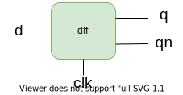
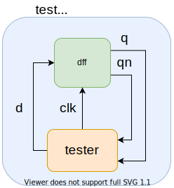
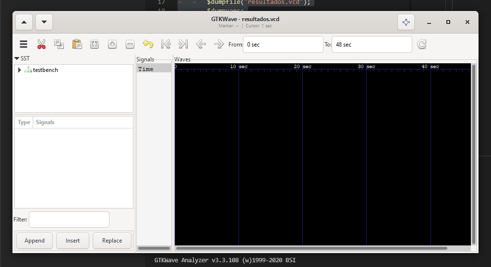
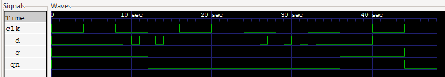

.. highlight:: verilog

Escribiendo un Programa Sencillo
================================

Esta sección describe en detalle el proceso de diseño, compilación y simulación de un flip-flop tipo D en verilog. Los archivos que contienen la descripción del flip-flop y requeridos para la simulación se pueden obtener en este `link a Google Drive <https://drive.google.com/drive/folders/1FOr-0SCtLgricK0VB0lXFM1SH62FQb76?usp=sharing>`_.

Descripción del circuito
------------------------

Se quiere implementar un flip-flop tipo D, cuyas entradas y salidas se muestran en la siguiente imagen:

Este módulo tendrá entradas ``d`` y ``clk`` y salidas ``q`` y ``qn`` y debe replicar correctamente el funcionamiento de un flip-flop tipo D.

Implementación en Verilog
-------------------------
Para el proceso de simulación se crean además dos módulos adicionales: ``tester`` y ``test_bench``, los cuales se pueden apreciar en la siguiente imagen

A continuación se presentan dichos módulos, los cuales se colocaron en archivos separados:

dff.v
^^^^^^

Este archivo contiene el módulo que describe el funcionamiento del flip-flop D::

    module dff(d,clk,q,qn);
        input d,clk;
        output reg q,qn;

        //Se inicializan los valores de los regs
        initial begin q=0; qn=1; end

        //Se realizarán cambios unicament en flancos positivos del reloj
        always @(posedge clk) 
        begin
            q  <= d;
            qn <= !d;
        end
    endmodule

Este módulo posee entradas ``clk`` y ``d`` y sus salidas son ``q`` y ``qn``, las cuales pueden cambiar de estado únicamente en los flancos positivos del reloj. El bloque ``initial`` es utilizado para inicializar las los valores de los tipo ``reg``.

tester.v
^^^^^^^^

Este archivo contiene el módulo encargado de generar las señales de prueba para la simulación, sus salidas son las entradas del flip-flop y viceversa::

    module tester (q,qn,clk,d);
        input q,qn; //Definimos las salidas del módulo flipflop como entradas al tester
        output clk,d;
        reg clk,d;

        //Un bloque always para la señal de reloj, con un periodo de 8 s
        always
        begin
            #4 clk=!clk;
        end

        //Se hace uso de un bloque initial para generar las señales de prueba
        initial
        begin
            clk=0;
            //Indicamos el archivo de resultados
            $dumpfile("resultados.vcd");
            $dumpvars;
            //Genramos la senal de prueba d
            d=0; #9 d=1; #1 d=0; #1 d=1; #2 d=0; #1 d=1; #12 d=0;
            #1 d=1; #2 d=0; #1 d=1; #1 d=0; #1 d=1; #1 d=0; # 7 d=1;
            #8 $finish; // Terminamos la simulación
        end
    endmodule

Este módulo genera la señal de reloj haciendo uso de un bloque always y los retardos introducidos por ``#n``, siendo n las unidades de tiempo correspondientes al retardo. De esta forma el reloj cambia su valor entre 0 y 1 cada 4 unidades de tiempo para obtener una señal cuadrada con un periodo de 8 unidades de tiempo (segundos por defecto).

Algo similar se hace en el bloque initial para variar la señal ``d`` de forma arbitraria. En adición a esto, en el bloque initial se encuentran las *system functions* requeridas para descargar los resultados de la simulación en el archivo *resultados.vcd*.

Finalmente el comando ``$finish`` indica el final de la simulación, para que esta no continúe indefinidamente.

testbench.v
^^^^^^^^^^^

Este es el módulo *top*. Consiste en una decripción estructural de las conexiones entre el módulo ``tester`` y el módulo ``dff``::

    `include "dff.v"
    `include "tester.v"

    module testbench;
        wire clk,d,q,qn;
        dff ff1(d,clk,q,qn);
        tester tst1(q,qn,clk,d);
    endmodule

Se puede pensar en este módulo como la protoboard donde se coloca el flip-flop y se conecta al ``tester`` por medio de cables. Es importante incluir los archivos que contienen los módulos  ``tester`` y ``dff`` instanciados, ya que de otra forma el compilador retornará un error.

.. highlight:: bash

Compilación y Simulación
------------------------

Una vez realizadas las descripciones en Verilog de nuestros módulos, procedemos a la etapa de compilación y verificación.

iVerilog
^^^^^^^^

Para compilar el diseño realizado ejecutamos el siguiente comando desde una terminal en el directorio que contiene los tres archivos descritos:

``iverilog -o dff_out test_bench.v``

De esta forma llamamos al compilador y le indicamos que almacene la salida compilada en el archivo dff_out. Además indicamos que compile a partir del archivo *test_bench.v*, donde se encuentran las instancias de nuestro flip-flop y probador.

Una vez obtenido el archivo compilado, es necesario ejecutar el simulador de iVerilog; vvp procesa el archivo compilado para obtener como resultado las señales en el tiempo correspondientes al diseño implementado:

``vvp dff_out``

Esto genera el archivo *resultados.vcd* según se indicó en la función ``$dumpfile`` dentro del probador. 

GTKWave
^^^^^^^

Finalmente, una vez obtenido el archivo de resultados, este puede ser visualizado con el software GTKWave de la siguiente manera:

``gtkwave resultados.vcd``

Lo que desplegará la interfaz gráfica del programa:

Luego, accediendo a la instancia tst1 puede desplegar las ondas correspondientes haciendo doble click en cada una:

.. image:: ./../img/ej_gtk2.PNG
    :align: center

Las señales obtenidas se presentan con mayor detalle en la siguiente imagen:

Podemos ver en primer lugar que se cumple el comportamiento esperado para un flip-flop tipo D. El valor de sus salidas Q y Qn no varía al cambiar su entrada D si no es en un flanco positivo de la señal de reloj CLK. De esta manera, validamos el funcionamiento del diseño realizado.