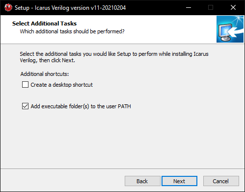

Instalación de iVerilog
=======================

Una vez que tiene acceso a Ubuntu o Windows, puede proceder con la instalación del compilador Icarus Verilog.

* :ref:`Instalación en Ubuntu`
* :ref:`Instalación en Windows`

Instalación en Ubuntu
---------------------
Abra una terminal (**Ctrl + Alt + T** en Ubuntu) y ejecute el siguiente comando:

``sudo apt install iverilog``

Se le solicitará una contraseña, utilice la misma configurada durante el proceso de instalación de Ubuntu.

En adición al compilador, también usaremos la herramienta `GTKWave <http://gtkwave.sourceforge.net/>`_ para visualizar los resultados durante el proceso de verificación. Para instalar esta herramienta, desde la misma terminal ejecute el siguiente comando:

``sudo apt install gtkwave``

Instalación en Windows
----------------------

Descargue el `instalador de iVerilog <http://bleyer.org/icarus/>`_. Inicie el instalador y siga las instrucciones de instalación en pantalla. Cuando se le solicite, seleccione la opción de añadir el ejecutable al PATH.

Este proceso instalará también la herramienta `GTKWave <http://gtkwave.sourceforge.net/>`_, la cuál será de utilidad para visualizar los resultados durante el proceso de verificación.