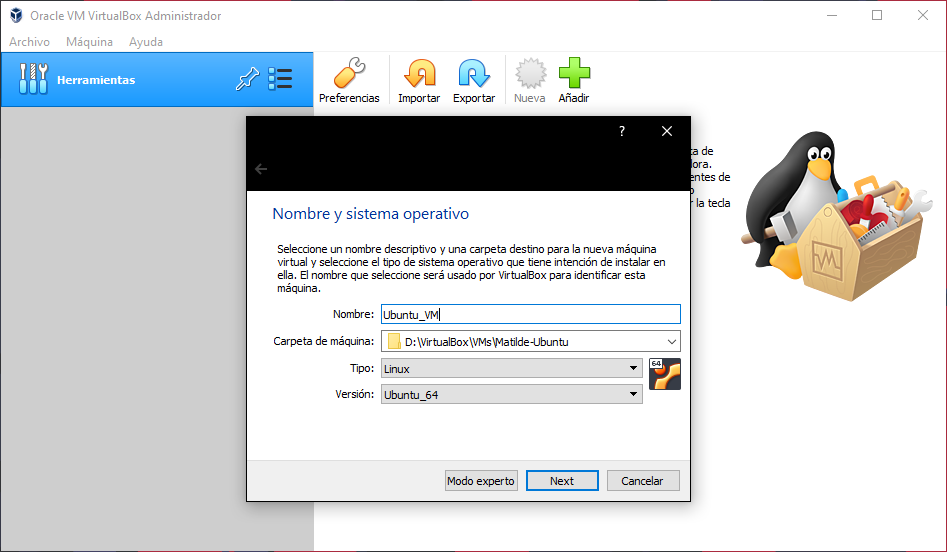
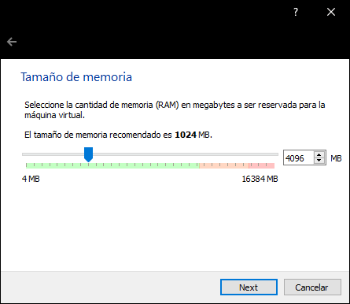
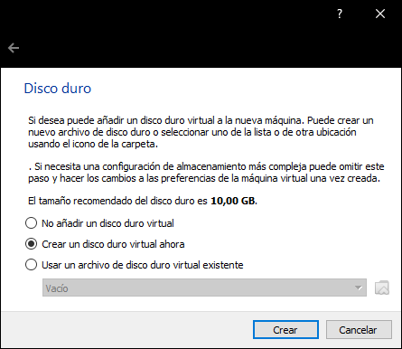
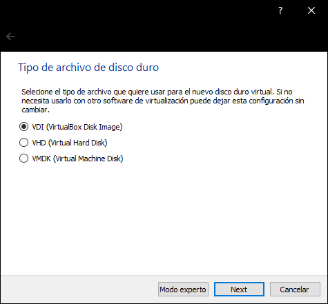
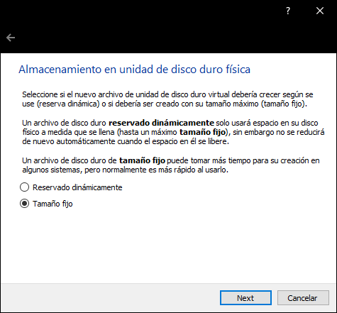
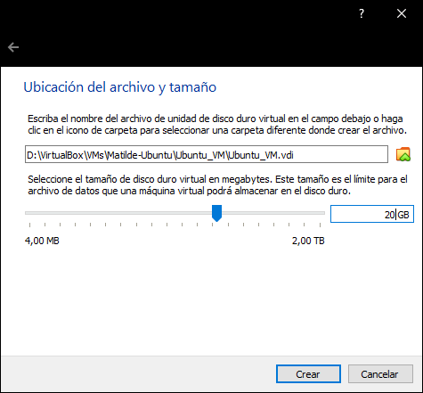
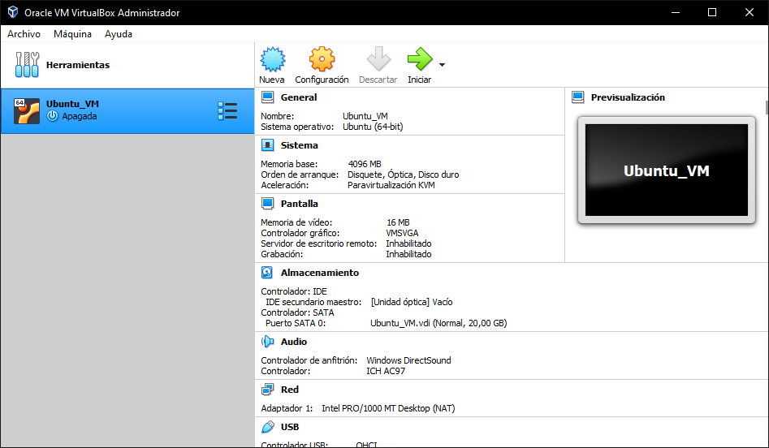
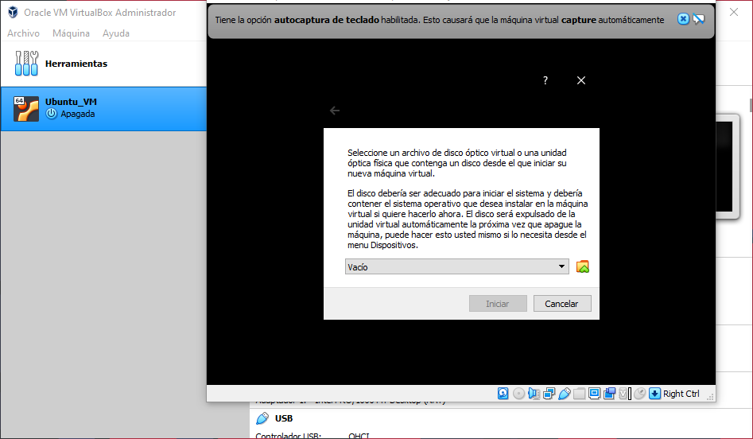

Instalación y Configuración de una Máquina Virtual
==================================================

Si ya posee una instalación de algún sistema operativo basado en Linux o Windows, puede continuar directamente con la :ref:`Instalación de iVerilog`.
Si no es el caso, y posee una instalación de macOS por favor siga los pasos descritos a continuación para la instalación de una máquina virtual
con el sistema Linux de su preferencia. De igual forma si posee una instalación de Windows pero desea configurar una máquina virtual con un sistema
operativo basado en Linux, puede realizar los siguientes pasos.

Descargas
---------

1. Descague y ejecute el instalador de VirtualBox, utilizando los siguientes links, según su sistema operativo:
    * `Windows <https://download.virtualbox.org/virtualbox/6.1.20/VirtualBox-6.1.20-143896-Win.exe>`_
    * `macOS <https://download.virtualbox.org/virtualbox/6.1.20/VirtualBox-6.1.20-143896-OSX.dmg>`_
2. Descargue la imagen del sistema operativo Linux de su preferencia, se recomienda `Ubuntu <https://ubuntu.com/download/desktop>`_,
   ya que el resto de la guía se realizó para este sistema operativo.

Creación de una máquina virtual
-------------------------------

Una vez instalado VirtualBox, ejecute este programa como administrador y siga los siguientes pasos:

1. Haga click en "nueva" para abrir la siguiente ventana de diálogo, indique un nombre y carpeta para su máquina virtual, seleccione además el tipo Linux y versión como se aprecia en la imagen:

2. El siguiente paso es seleccionar el tamaño de la memoria (RAM) que desea asignarle a su máquina virtual. Se recomienda un mínimo de 4 GB.

3. En la siguiente ventana, seleccione la opción "Crear un disco duro virtual ahora" y haga click en "Crear".

4. Seleccione la opción "VDI" y haga click en "Next":

5. Seleccione la opción "Tamaño fijo" y haga click en "Next":

6. Finalmente indique el tamaño del disco duro que desea asignar a su máquina virtual. Tome en cuenta que este espacio ya no será accesible para su sistema operativo principal. Para nuestros fines unos 20 GB son más que suficientes.

7. Una vez terminada la configuración de su máquina virtual, debería ver algo similar a lo mostrado en la siguiente imagen:

Instalación de Ubuntu en la máquina virtual
-------------------------------------------

Una vez que su máquina virtual ha sido creada y configurada, puede realizar la instalación de el sistema operativo en esta. Para esto haga doble click en el botón "Iniciar" en VirtualBox y seleccione la imagen ISO del sistema operativo de su preferencia descargada previamente:

   
Siga las instrucciones de instalación en pantalla. Cuando se le solicite, seleccione la opción "Erase disk and install Ubuntu". Una vez terminada la instalación de Ubuntu puede seguir a la sección :ref:`Instalación de iVerilog`.