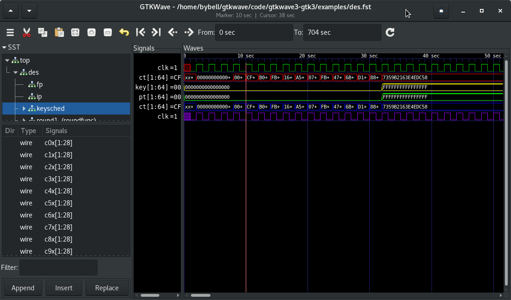

Introducción a Icarus Verilog
=============================

`Icarus Verilog <http://iverilog.icarus.com/>`_ es un compilador que trabaja con el estándar
`Verilog IEEE 1364 <https://en.wikipedia.org/wiki/Verilog>`_. Verilog es un lenguaje de descripción de hardware (HDL) utilizado para modelar sistemas
electrónicos, de especial interés es su aplicación en el diseño y verificación de circuitos digitales.
En esta guía se detalla el proceso de descarga, instalación y la creación de un pequeño programa junto con el proceso de compilación,
simulación y verificación. Esto con el fin de introducir los conceptos y estructuras más importantes de este lenguaje.

Simulación y Síntesis
---------------------

Verilog es un lenguaje que permite simular el funcionamiento de los circuitos digitales, obteniendo las *waveforms* de las distintas señales involucradas en el circuito descrito. Para visualizar dichos resultados se utilizará el software GTWave.

La síntesis de circuitos digitales es también algo que se debe tener en cuenta a la hora de construir código en verilog, ya que idealmente se desea que todo el código sea sintetizable. Hay ciertas prácticas o casos que pueden hacer que el código realizado no sea sintetizable, los cuales se detallaran a lo largo de esta guía. Finalmente, para la síntesis de los circuitos digitales a partir de código en Verilog, se pueden utilizar herramientas como `YOSYS <http://www.clifford.at/yosys/>`_.
